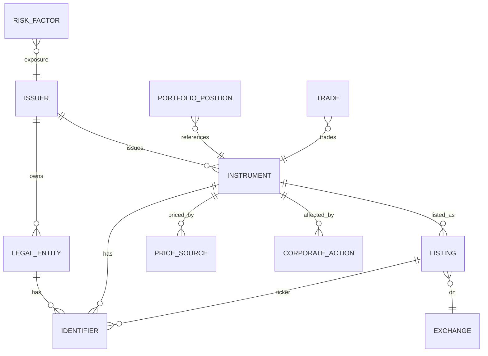
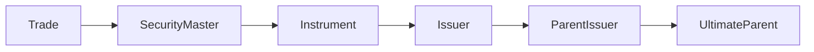
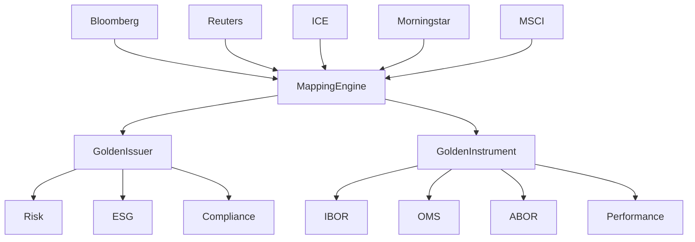
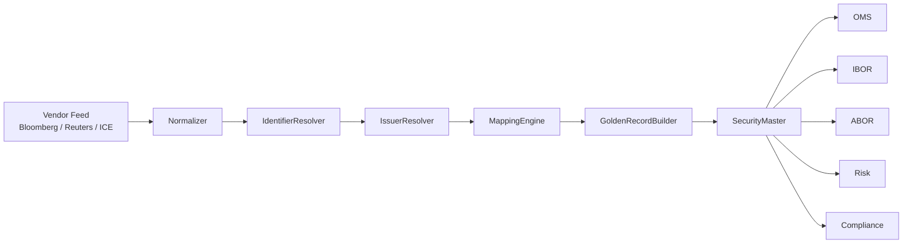

如果是Buy Side 资产管理公司，而不是投行，那么 **Issuer、Instrument、Mapping** 往往属于整个 **Reference Data（参考数据）** 或 **Security Master（证券主数据）** 的核心。

真正的数据模型比很多人想象的复杂得多，并不是一张 Instrument 表对应一张 Issuer 表。

一个比较典型的逻辑如下：



---

# 1. Issuer（发行人）

Issuer 本质不是证券。

它是一个 Legal Entity。

例如

| Issuer                | 类型    |
| --------------------- | ----- |
| Apple Inc.            | 上市公司  |
| Microsoft Corporation | 上市公司  |
| US Treasury           | 政府    |
| Toyota Motor          | 上市公司  |
| HSBC Holdings         | 银行    |
| BlackRock             | 基金管理人 |

Issuer 通常拥有：

* Internal Issuer ID
* LEI
* Bloomberg Entity ID
* S&P Entity ID
* Moody Entity ID
* Country
* Sector
* Industry
* Parent Company
* Ultimate Parent
* Credit Rating
* ESG Rating
* Risk Country

真正的大型机构一般都会维护一个 **Issuer Master**。([Finos Foundation][1])

---

# 2. Instrument（金融工具）

Instrument 是可以买卖的对象。

例如：

Apple 可以发行：

```
Apple Inc.
    │
    ├── Common Stock
    ├── Preferred Stock
    ├── Bond 2028
    ├── Bond 2035
    ├── Bond 2045
    ├── Convertible Bond
    ├── Commercial Paper
```

每一个都是一个 Instrument。

Instrument 会拥有：

* Internal Instrument ID
* ISIN
* CUSIP
* FIGI
* Bloomberg Yellow Key
* Sedol
* Reuters RIC
* CFI Code
* Asset Class
* Currency
* Coupon
* Maturity
* Callable
* Floating Rate
* Day Count
* Issue Date

这些通常属于 Instrument Master（也称 Security Master）。([Devancore][2])

---

# 3. 一个 Issuer 对多个 Instrument

这是最常见关系：

```text
Issuer
   │
   ├──── Bond A
   ├──── Bond B
   ├──── Bond C
   ├──── Equity
   ├──── ADR
   └──── Option
```

因此

```
Issuer 1 ---- N Instrument
```

几乎所有 Security Master 都采用这种关系。([SAP Help Portal][3])

---

# 4. Instrument Mapping 是什么

真正麻烦的是：

同一个 Instrument，

不同 Vendor ID 完全不同。

例如 Apple 股票：

| Vendor      | Identifier    |
| ----------- | ------------- |
| ISIN        | US0378331005  |
| CUSIP       | 037833100     |
| Bloomberg   | BBG000B9XRY4  |
| FIGI        | BBG000B9XRY4  |
| Reuters     | AAPL.O        |
| Morningstar | 0P0000GY8O    |
| Internal    | INS0000000123 |

因此会有一张 Mapping 表。

例如：

```text
Instrument
------------
InternalInstrumentId

Identifier
------------
InstrumentId
IdentifierType
IdentifierValue
Source
ValidFrom
ValidTo
```

例如

```
10001
ISIN
US0378331005

10001
CUSIP
037833100

10001
FIGI
BBG000B9XRY4

10001
SEDOL
2046251
```

很多金融机构都会维护几十种 Identifier。

---

# 5. Issuer Mapping

Issuer 更麻烦。

因为：

```
Apple Inc.
APPLE INC
APPLE COMPUTER INC.
Apple Computer
APPLE INC US
```

Vendor 不一致。

于是需要

```
InternalIssuerId

LEI

Bloomberg Entity

S&P Entity

Moody Entity

FactSet Entity

OpenFIGI Entity
```

再维护 Mapping。

FINOS 的证券参考数据工作组甚至专门讨论过 Issuer Mapping，因为并不存在一个覆盖率 100% 的全球统一 Issuer ID，通常需要结合 LEI、CUSIP 前缀及算法匹配。([Finos Foundation][1])

---

# 6. 际一般还会再拆一层

很多 Buy Side（包括BlackRock、Capital Group）不会直接：

```
Trade
    ↓
Instrument
```

而是：



因为 Risk 并不是看 Instrument。

例如：

你买了：

```
Apple Bond 2030

Apple Bond 2035

Apple Bond 2045
```

Portfolio Manager 关心：

```
三个债券
```

Risk Manager 关心：

```
Apple Exposure
```

因此：

```
Bond2030
Bond2035
Bond2045

↓

Issuer

↓

Exposure
```

Credit Risk、Issuer Concentration、Country Exposure、Sector Exposure 都是建立在 Issuer 维度，而不是 Instrument 维度。

---

# 7. 最复杂的其实不是 Instrument，而是 Mapping

真正大型资产管理公司的 Reference Data 往往更接近下面这样：



每天都会接收来自 Bloomberg、LSEG/Reuters、ICE、MSCI 等多个数据源的参考数据，通过 **Mapping Engine** 合并生成内部唯一的 **Golden Record（黄金记录）**，再供 IBOR、ABOR、OMS、风险、合规、绩效等系统统一使用。([Devancore][2])

---

## Reference Data 通常会维护至少四个层次

1. **Legal Entity / Issuer Master**：公司、政府、基金发行人等法律实体。
2. **Instrument / Security Master**：股票、债券、基金、期权、掉期等可交易工具。
3. **Identifier Mapping**：ISIN、CUSIP、FIGI、SEDOL、RIC、Ticker、内部 ID 等各种标识符之间的映射。
4. **Hierarchy Mapping**：Issuer → Parent → Ultimate Parent，以及 Instrument → Underlying → Basket → Index 等层级关系，用于风险聚合、监管报送和投资分析。

[1]: https://finosfoundation.atlassian.net/wiki/spaces/DT/pages/1463681028/Mapping%2BIssuer%2Brecords?utm_source=chatgpt.com "Mapping Issuer records - Data Technologies - Confluence"
[2]: https://devancore.com/glossary/instrument-master-securities/?utm_source=chatgpt.com "Instrument Master Data — Securities & Digital Assets"
[3]: https://help.sap.com/docs/FS_DATA_MANAGEMENT/67e034d1b3fc4ebcbc3514bd8da035ea/f3bd0cc0094940be8e7e3f70a18c4129.html?utm_source=chatgpt.com "Business Partner | SAP Help Portal"


----------------


如果是 BlackRock、State Street、JPMAM 这种 Buy Side，一个 Security Master 的核心逻辑其实可以浓缩成 **"Normalization → Mapping → Golden Record → Downstream"** 四步。

下面这个伪代码（Python 风格）比较接近真实业务。

---

## 数据结构

```python
class VendorSecurity:
    vendor: str

    isin: str
    cusip: str
    figi: str
    ric: str
    sedol: str

    issuer_name: str
    instrument_name: str

    currency: str
    maturity: date
    coupon: float
```

内部统一模型：

```python
class Issuer:
    issuer_id: str
    legal_name: str
    lei: str


class Instrument:
    instrument_id: str

    issuer_id: str

    asset_type: str

    identifiers: dict[str, str]

    maturity: date
    coupon: float
```

---

# 第一步：收到 Vendor 数据

例如每天 Bloomberg、Reuters、ICE 都会推送：

```python
vendor_records = [
    bloomberg_security,
    reuters_security,
    ice_security,
]
```

例如：

```
Bloomberg

ISIN
US0378331005

FIGI
BBG000B9XRY4

Issuer
APPLE INC


Reuters

RIC
AAPL.O

ISIN
US0378331005

Issuer
Apple Inc.


ICE

CUSIP
037833100

Issuer
Apple Computer Inc.
```

---

# 第二步：寻找已有 Instrument

真正的逻辑不会只查 ISIN。

一般会：

```python
def find_existing(record):

    keys = [
        record.isin,
        record.figi,
        record.cusip,
        record.ric,
        record.sedol
    ]

    for key in keys:
        if mapping_table.contains(key):
            return mapping_table.lookup(key)

    return None
```

因为：

有时候 Vendor 根本没有 ISIN。

有时候 FIGI 才有。

有时候只有 RIC。

---

# 第三步：没有找到怎么办？

建立新的 Golden Instrument

```python
if instrument is None:

    instrument = Instrument()

    instrument.instrument_id = generate_id()

    security_master.save(instrument)
```

---

# 第四步：Issuer Mapping

这里比 Instrument 更复杂。

```python
issuer = issuer_master.find_by_lei(record.lei)

if issuer is None:

    issuer = issuer_master.find_by_name(record.issuer_name)

if issuer is None:

    issuer = create_new_issuer(record)
```

真实系统通常还会：

```python
fuzzy_match()

soundex()

normalize_company_suffix()

remove_punctuation()

remove_country_suffix()
```

例如：

```
APPLE INC

Apple Inc.

APPLE COMPUTER INC

Apple Computer
```

最终都 Mapping 到：

```
IssuerID = 20035
```

---

# 第五步：建立 Mapping

假设内部生成了

```
InstrumentID = 100256
```

那么：

```python
mapping_table.add(

    identifier="US0378331005",

    type="ISIN",

    instrument_id=100256
)

mapping_table.add(

    identifier="BBG000B9XRY4",

    type="FIGI",

    instrument_id=100256
)

mapping_table.add(

    identifier="037833100",

    type="CUSIP",

    instrument_id=100256
)

mapping_table.add(

    identifier="AAPL.O",

    type="RIC",

    instrument_id=100256
)
```

以后无论哪个 Vendor 来，都直接找到同一个 Instrument。

---

# 第六步：Merge Vendor 数据

多个 Vendor 的数据可能互补。

例如：

Bloomberg

```
Coupon = 4.25
```

Reuters

```
Coupon = null
```

ICE

```
Coupon = 4.2500
```

业务逻辑通常：

```python
instrument.coupon = choose_best(

    bloomberg.coupon,

    reuters.coupon,

    ice.coupon
)
```

而不是：

```
最后来的覆盖前面的
```

很多公司都会维护 Source Priority：

```python
SOURCE_PRIORITY = [

    "Bloomberg",

    "Reuters",

    "ICE",

    "Morningstar"
]
```

然后：

```python
def choose_best(values):

    for vendor in SOURCE_PRIORITY:

        if values[vendor] is not None:
            return values[vendor]

    return None
```

---

# 第七步：生成 Golden Record

最后得到：

```python
Instrument(

    instrument_id="INS100256",

    issuer_id="ISS20354",

    identifiers={

        "ISIN": "...",

        "FIGI": "...",

        "CUSIP": "...",

        "RIC": "...",

    },

    coupon=4.25,

    maturity=2035-09-15
)
```

整个公司以后全部引用：

```
INS100256
```

而不是 Bloomberg ID。

---

# 第八步：Trade 进入系统

OMS 发来：

```python
Trade(

    isin="US0378331005",

    quantity=1000000
)
```

业务代码：

```python
instrument = mapping.find_by_isin(trade.isin)

trade.instrument_id = instrument.id

save_trade(trade)
```

以后所有系统：

```
Risk

Performance

IBOR

ABOR

Compliance

Analytics
```

全部使用：

```
instrument_id
```

而不是 ISIN。

---

# 第九步：Risk 聚合

风险系统根本不关心 ISIN。

```python
for trade in portfolio:

    instrument = security_master.get(trade.instrument_id)

    issuer = issuer_master.get(instrument.issuer_id)

    exposure[issuer.id] += trade.market_value
```

得到：

```
Apple Exposure

Microsoft Exposure

Tesla Exposure
```

而不是：

```
Apple Bond 2028

Apple Bond 2030

Apple Bond 2035
```

---

## 更接近真实生产系统的架构

真正的大型资管公司的 Security Master 往往会把这些逻辑拆成多个独立服务，而不是一个函数：



这种职责划分有几个好处：

* **Normalizer**：负责不同 Vendor 字段格式的标准化。
* **IdentifierResolver**：依据 ISIN、FIGI、CUSIP、RIC 等标识符解析是否已存在。
* **IssuerResolver**：解决发行人匹配（LEI、名称规范化、模糊匹配等）。
* **MappingEngine**：维护各种 Identifier 到内部 ID 的映射关系及历史版本。
* **GoldenRecordBuilder**：按照 Source Priority、数据质量规则、时间戳等策略生成唯一可信的 Golden Record。

这种流水线式设计比单体实现更容易扩展新的数据源、支持不同资产类别（股票、债券、基金、衍生品），也更符合BlackRock 等大型 Buy Side 的生产实践。


---------------------------


有，而且比很多人想象得多。不过需要说明一点：

> **真正的大型 Buy Side（BlackRock、Capital Group）的 Security Master / Instrument Mapping 系统基本都是内部核心资产，不会开源。**

但是有不少项目、标准和文档，已经能让你理解 70%~90% 的业务模型。

我推荐按下面的顺序学习。

---

# 1. FINOS Securities Reference Data（最推荐）

这是目前**最接近真实金融机构 Reference Data** 的开源项目。

**GitHub：**

[FINOS Securities Reference Data](https://github.com/finos/secref-data?utm_source=chatgpt.com)

项目目标就是：

* Security Master
* Instrument Identifier
* Identifier Mapping
* Golden Record
* Vendor Mapping

不是写代码，而是在讨论整个行业的数据模型。

FINOS 官方也解释了为什么需要它：

> 不同 Vendor 使用不同 Security ID，导致交易生命周期中的数据整合困难，因此需要统一 Canonical Mapping。([Finos Foundation][1])

它里面经常讨论：

```text
ISIN

CUSIP

FIGI

RIC

SEDOL

Vendor Mapping

Golden Security
```

这些就是每天都在处理的东西。

---

# 2. FINOS Common Domain Model（CDM）

GitHub：

[FINOS Common Domain Model](https://github.com/finos/common-domain-model?utm_source=chatgpt.com)

这是整个金融行业目前最重要的数据模型之一。

它不是讲 Mapping，

而是讲：

```text
Trade

Position

Execution

Settlement

Product

Party

Legal Entity
```

如果你以后要理解：

IBOR

ABOR

OMS

EMS

Trade Lifecycle

几乎绕不开 CDM。([GitHub][2])

---

# 3. FDC3 Instrument Context

很多人以为 FDC3 是桌面互操作。

其实它的 Context Data 非常值得看。

例如：

Instrument

官方 Schema：

[FDC3 Instrument Context](https://fdc3.finos.org/docs/2.0/context/ref/Instrument?utm_source=chatgpt.com)

它直接定义：

```typescript
interface Instrument {

    id: {

        ISIN?: string

        FIGI?: string

        RIC?: string

        CUSIP?: string

        SEDOL?: string

        PERMID?: string

        ticker?: string

    }

}
```

为什么？

因为现实就是：

**没有任何一个 ID 能覆盖所有 Vendor。**

所以一个 Instrument 可以拥有：

```text
ISIN

CUSIP

FIGI

RIC

Ticker

SEDOL
```

全部同时存在。([FDC3][3])

这与你前面问到的 Mapping 几乎完全一致。

---

# 4. OpenFIGI

Bloomberg 做的免费 Mapping API。

官方：

[OpenFIGI](https://www.openfigi.com/?utm_source=chatgpt.com)

它本质就是：

```text
CUSIP

↓

FIGI


ISIN

↓

FIGI


Ticker

↓

FIGI
```

例如：

```http
POST /mapping

{
    "idType":"ID_ISIN",
    "idValue":"US0378331005"
}
```

返回：

```json
{
    "figi":"BBG000B9XRY4"
}
```

如果你以后自己写 Security Master，

几乎一定会参考它。

---

# 5. Symbology Mapping

很多 Vendor 都公开介绍过自己的 Symbology。

例如：

Bloomberg

FactSet

LSEG

Morningstar

都会介绍：

```text
Identifier

Mapping

Cross Reference

Symbology
```

建议搜索关键词：

```text
Financial Symbology

Security Master

Cross Reference

Instrument Identifier
```

---

# 6. Legend（非常推荐）

GitHub：

[FINOS Legend](https://github.com/finos/legend?utm_source=chatgpt.com)

这是 Goldman Sachs 开源出来的。

虽然它不是 Security Master，

但是：

它的数据建模方式，

几乎就是大型金融公司的建模方式。

例如：

```text
LegalEntity

Issuer

Product

Trade

Security

Position
```

全部都是强类型模型。

很多 Buy Side 都参考 Legend 做 Enterprise Data Model。([GitHub][2])

---

# 7. QuantLib（理解 Instrument）

GitHub：

[QuantLib](https://github.com/lballabio/QuantLib?utm_source=chatgpt.com)

不是 Mapping。

而是：

各种 Instrument 如何建模。

例如：

```text
Bond

Swap

Option

Future

CDS
```

如果以后你想知道：

Instrument 到底有哪些属性，

这是最好的教材。

---

# 8. OpenGamma Strata（最值得看源码）

GitHub：

[OpenGamma Strata](https://github.com/OpenGamma/Strata?utm_source=chatgpt.com)

如果说：

QuantLib 偏数学，

那么 Strata 偏业务。

里面大量代码就是：

```text
Security

Trade

Position

Portfolio

ReferenceData
```

ReferenceData 在 Strata 中几乎就是：

```java
SecurityId

↓

Security

↓

Product

↓

Trade
```

这种设计非常接近真实金融机构。

---

# 9. 真正值得看的论文 / 文档

最后推荐几个关键词，比找代码更有价值。

搜索：

```text
Security Master Architecture

Golden Record Financial Data

Reference Data Management

Entity Resolution Finance

Instrument Symbology

Corporate Actions

Security Identifier Mapping
```

基本都是各大银行的数据团队分享。

---

## 如果你的目标是「理解 Reference Data / Security Master」，我建议按这个阅读路线：

| 优先级   | 项目                                                                                                      | 学习内容                                             |
| ----- | ------------------------------------------------------------------------------------------------------- | ------------------------------------------------ |
| ⭐⭐⭐⭐⭐ | [FINOS Securities Reference Data](https://github.com/finos/secref-data?utm_source=chatgpt.com)          | Identifier Mapping、Golden Record、Security Master |
| ⭐⭐⭐⭐⭐ | [FINOS Common Domain Model](https://github.com/finos/common-domain-model?utm_source=chatgpt.com)        | Trade、Product、Party、生命周期                         |
| ⭐⭐⭐⭐☆ | [FDC3 Instrument Schema](https://fdc3.finos.org/docs/2.0/context/ref/Instrument?utm_source=chatgpt.com) | Instrument 的标准数据结构                               |
| ⭐⭐⭐⭐☆ | [OpenFIGI](https://www.openfigi.com/?utm_source=chatgpt.com)                                            | Identifier Mapping API                           |
| ⭐⭐⭐⭐☆ | [FINOS Legend](https://github.com/finos/legend?utm_source=chatgpt.com)                                  | 企业级金融数据模型                                        |
| ⭐⭐⭐⭐☆ | [OpenGamma Strata](https://github.com/OpenGamma/Strata?utm_source=chatgpt.com)                          | 真实业务代码建模                                         |
| ⭐⭐⭐☆☆ | [QuantLib](https://github.com/lballabio/QuantLib?utm_source=chatgpt.com)                                | 金融工具对象模型                                         |

如果你的目的不仅是理解业务，而是**设计类似的 Security Master / Instrument Master 系统**，那么真正值得研究的不是单个项目，而是 **FINOS SecRef Data + OpenGamma Strata + OpenFIGI** 这三个组合，它们分别覆盖了**数据治理、领域模型和标识符映射**三个核心维度。

[1]: https://finosfoundation.atlassian.net/wiki/spaces/DT/pages/656834673/Security%2BReference%2BData%2BWG?utm_source=chatgpt.com "Security Reference Data Project - Data Technologies - Confluence"
[2]: https://github.com/finos?utm_source=chatgpt.com "The Fintech Open Source Foundation (www.finos.org) · GitHub"
[3]: https://fdc3.finos.org/docs/2.0/context/ref/Instrument?utm_source=chatgpt.com "Instrument | FDC3"


